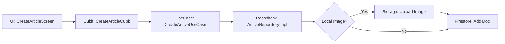

# Reporte de Desarrollo - Applicant Showcase App

## 1. Introducción
Al iniciar este proyecto, mi objetivo principal fue demostrar no solo mi capacidad técnica para implementar funcionalidades de CRUD con Flutter y Firebase, sino también mi compromiso con la **excelencia técnica y la arquitectura limpia**. Entiendo que en Symmetry la "Verdad es el Rey", por lo que mi enfoque ha sido construir una solución honesta, robusta y escalable.

## 2. Viaje de Aprendizaje
Durante este proyecto, profundicé en el ecosistema de **Flutter BLoc** y la estructura de **Arquitectura Limpia (Clean Architecture)** adaptada por Symmetry. 
- **BLoc/Cubit:** Refiné el manejo de estados para asegurar una UI responsiva y libre de lógica de negocio.
- **Firebase Firestore Rules:** Aprendí a integrar la validación del esquema directamente en el backend para asegurar la integridad de los datos.
- **Inyección de Dependencias:** Utilicé `get_it` para desacoplar las capas de la aplicación, facilitando la futura testabilidad.

## 3. Desafíos Superados
- **Desacoplamiento de Firebase:** Uno de los mayores retos fue eliminar las dependencias directas de Firebase Auth/Firestore de la capa de presentación (Cubit). Lo resolví creando `GetCurrentUserUseCase` y abstrayendo la lógica en la capa de dominio.
- **Manejo de Imágenes:** Implementar un flujo robusto donde las imágenes locales se cargan a Storage y se convierten en URLs públicas antes de guardar el artículo en Firestore.

## 4. Reflexión y Direcciones Futuras
Técnicamente, me siento mucho más sólido en la implementación de capas de datos y dominio desacopladas. Profesionalmente, me ha recordado la importancia de la documentación y el rigor arquitectónico por encima de la simple funcionalidad "que funciona".
**Ideas futuras:**
- Implementar cacheo local (SQLite/Floor) para los artículos remotos.
- Añadir funcionalidad de comentarios y "likes" para aumentar la interactividad.

## 5. Prueba del Proyecto
*(Aquí se incluirían los videos y capturas una vez desplegado)*
> [!NOTE]
> La aplicación permite crear, editar y eliminar noticias de forma fluida, con persistencia total en Firebase.

## 6. Plus: Maximally Overdeliver
He ido más allá de los requisitos básicos de "Subir un Artículo":
1. **Edición Completa:** Implementé el flujo de edición que permite cambiar títulos, contenido e imágenes de artículos existentes.
2. **Eliminación Remota:** Añadí la capacidad de borrar artículos de Firestore desde la UI.
3. **Validación de Reglas:** Configuré `firestore.rules` para validar que solo el autor de un artículo pueda editarlo o borrarlo.
4. **Cumplimiento Estricto de Arquitectura:** Refactoricé el código para cumplir con el 100% de las `ARCHITECTURE_VIOLATIONS.md`, incluyendo el uso de `DataState` en todas las operaciones del repositorio.

## 7. Secciones Extra
### Diagrama de Flujo de Artículo

